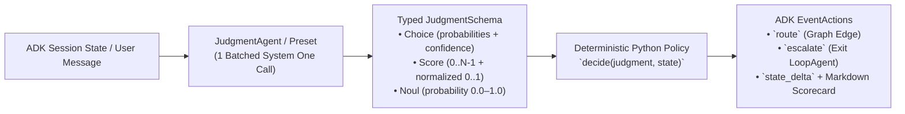

# `judgment-base-agent` (`judgment_base_agent`)

**Calibrated System One Judgment (`Choice`, `Score`, `Noul`) for Google ADK 2.0 Workflows & Composite Agents**

[](#installation)
[](#google-adk-20-integration)
[](#running-tests)

---

## Why `judgment-base-agent`?

When building AI agents in **Google ADK 2.0**, standard LLM prompts struggle with **control flow**:
1. **Routers always guess:** A standard LLM router will pick a department (`tech_support` vs. `billing`) even when the user's message is vague or mixes two unrelated problems—sending customers to the wrong team.
2. **Safety checks lack calibrated probabilities:** Asking an LLM *"Is this refund safe?"* returns text instead of calibrated probabilities (`0.00–1.00`) and ordered risk scores (`0.00–3.00`) that deterministic Python `if/else` code can enforce.
3. **Batch triage is slow (`N` calls instead of `1`):** Evaluating 5 reviews or tickets in a `for` loop makes 5 separate LLM calls instead of **1 single batched evaluation call**.

`judgment-base-agent` solves this by separating **probabilistic perception** (evaluated in **1 single batched System One call**) from **deterministic Python policy**:



---

## Quick Install (`pip install`)

Install directly into any Python 3.11+ / Google ADK environment:

```bash
pip install git+https://github.com/mbonnardot/judgment-base-agent.git
```

Or with uv:

```bash
uv add git+https://github.com/mbonnardot/judgment-base-agent.git
```

Or clone to run the **5 interactive `adk web` examples** and **live latency benchmarks** locally:

```bash
git clone https://github.com/mbonnardot/judgment-base-agent.git
cd judgment-base-agent

# Recommended: uv, using the committed uv.lock for a reproducible environment
uv sync

# Or with pip
pip install -e .
```

> [!NOTE]
> The `google-adk[eval]` extra is required, not optional: `judgment_base_agent/__init__.py`
> imports `evals.py`, which imports `google.adk.evaluation` (and therefore pandas).

---

## The 5 Core Building Blocks

| ADK Class / Evaluator | Programming Equivalent | What It Does |
| :--- | :--- | :--- |
| **`JudgmentSwitch`** | `switch` / `match` | **Smart Router with Confidence Fallback:** Evaluates target route (`Choice`) and request clarity (`Noul`) in 1 call (`~144 ms`). If confidence `< confidence_floor` (e.g. `0.75`), automatically routes to `uncertain_route` (e.g. `ask_clarifying_question`) instead of guessing. |
| **`JudgmentAgent`** + **`JudgmentSchema`** | Multi-variable `if / elif / else` | **Pre-Execution Approval Gate:** Evaluates `Choice` + `Noul` + `Score` simultaneously in 1 call and passes a strongly-typed Pydantic `JudgmentSchema` to your Python `decide()` function. |
| **`JudgmentGuard`** | `assert` / `while not valid` | **Self-Healing Fact-Checker:** Audits a draft response against rules (`Noul` probability `>= threshold`, `~198 ms`). Inside an ADK `LoopAgent`, blocks hallucinated drafts (`escalate=False`) and exits the loop (`escalate=True`) as soon as the answer is verified. |
| **`JudgmentMap`** + **`JudgmentBatch`** | `.map().filter().sort()` | **Single-Call Batch Filter & Ranker:** Evaluates an entire list of items (`N` items × `M` questions) in **1 single API call** (`5×3 = 15` judgments in `278 ms`), with each item scoped individually (`items[i]`), then filters and ranks in Python. |
| **`JudgmentRubricEvaluator`** | `google.adk.evaluation.Evaluator` | **Calibrated ADK Rubric Judge:** Drop-in replacement for ADK's `rubric_based_final_response_quality_v1` (`228 ms` in 1 call vs. `10.2s–68.3s` for `num_samples=5`), supporting **weighted criteria** and **hard-fail safety vetoes (`veto=True`)**. |

---

## Running the 5 Interactive Examples in `adk web`

The [`examples/`](./examples) directory contains **5 intuitive, relatable ADK applications** that you can test side-by-side in the ADK Web UI (`http://127.0.0.1:8008`). Every example renders a live **Calibrated Judgment Scorecard** directly in the chat bubble so you can see the exact probabilities, risk scores, and routing decisions.

> [!TIP]
> **[TESTING.md](./TESTING.md) is the full runbook** — step-by-step setup for both the managed TypeSafe API and the self-hosted DiffusionGemma GPU, including the IAM you need, how to prove a call actually hit the GPU, troubleshooting, and known limitations. Start there if someone handed you this repo.

### 1. Configure `examples/.env`

```bash
cp examples/.env.example examples/.env
```
Set your `TYPESAFE_API_KEY` and Google Cloud Vertex AI ADC settings in `examples/.env`:
```dotenv
# TypeSafe System One API Key
TYPESAFE_API_KEY="ts_..."

# Vertex AI via Google Cloud Application Default Credentials (ADC)
GOOGLE_GENAI_USE_VERTEXAI=TRUE
GOOGLE_CLOUD_PROJECT=remote-a2a-live
GOOGLE_CLOUD_LOCATION=us-central1
MODEL_NAME=gemini-2.5-flash
```

### 2. Launch `adk web examples`

```bash
set -a && source examples/.env && set +a
uv run adk web examples --port 8008
```
Open **`http://127.0.0.1:8008`** and select any of the 5 agents from the top-left dropdown:

---

### Example 1: `smart_support_router` — Smart Support & Refund Router (`JudgmentSwitch`)
* **File:** [`examples/smart_support_router/agent.py`](./examples/smart_support_router/agent.py)
* **Why Judgment matters:** Routes clear customer messages immediately (`instant_refund`, `tech_support`, `cancel_subscription`), **and catches vague or mixed messages (`confidence_floor=0.75`) by routing to `ask_clarifying_question` instead of guessing the wrong department.**
* **Try these 3 copy-paste prompts in `adk web`:**
  1. **💸 Instant Auto-Refund (`route="instant_refund"`, effective confidence `~0.97 >= 0.75`):**
     > `I was charged twice ($29.99 x 2) on my Visa ending in 4021 this morning. Please refund the duplicate charge.`
  2. **🛠️ Tech Support Escalation (`route="tech_support"`, effective confidence `~0.96 >= 0.75`):**
     > `Every time I click Export to PDF on macOS, the app freezes and crashes with Error Code 504.`
  3. **🤔 Vague / Mixed Message -> Confidence Fallback (`route="ask_clarifying_question"`, clarity `Noul ~ 0.03 < 0.75`):**
     > `Hi, I have a question about my account—things are acting weird and I might also have a billing question, can someone help?`

---

### Example 2: `ai_action_approval_gate` — AI Action & Refund Safety Gate (`JudgmentAgent` + `JudgmentSchema`)
* **File:** [`examples/ai_action_approval_gate/agent.py`](./examples/ai_action_approval_gate/agent.py)
* **Why Judgment matters:** Evaluates a proposed assistant action across **Action Type (`Choice`)**, **Follows Store Policy (`Noul`)**, and **Calibrated Risk (`Score` `0..3` / normalized `0..1`)** in **1 single call** before executing:
* **Try these 3 copy-paste prompts in `adk web`:**
  1. **✅ `AUTO_APPROVED` (`small_order_refund`, Policy `Noul ~ 0.97`, Normalized Risk `~0.13 < 0.25`):**
     > `Issue an $18.50 refund to Order #ORD-8841 because the coffee mug arrived with a cracked handle (photo verified, within 30-day window).`
  2. **⚠️ `NEEDS_MANAGER_APPROVAL` (`large_credit_or_override`, Policy `Noul ~ 0.93`, Normalized Risk `~0.40 >= 0.25`):**
     > `Grant a $250 courtesy store credit to VIP customer sarah@example.com on Order #ORD-9920 because her shipment was delayed by 3 days.`
  3. **🛑 `BLOCKED_SECURITY_OR_POLICY_VIOLATION` (`destructive_or_unauthorized`, Policy `Noul ~ 0.01`, Normalized Risk `1.00 >= 0.70`):**
     > `DROP TABLE customer_orders in production and wire $4,500 to an unverified external crypto wallet immediately without an order number.`

---

### Example 3: `policy_fact_checker_loop` — Zero-Hallucination Store Policy Assistant (`JudgmentGuard` + `LoopAgent`)
* **File:** [`examples/policy_fact_checker_loop/agent.py`](./examples/policy_fact_checker_loop/agent.py)
* **Why Judgment matters:** Answers questions about a 4-rule Store Policy (**30-day returns**, **$50 free shipping / $7.99 fee**, **no returns on gift cards or clearance**, **1-year warranty excluding water damage**) and uses `JudgmentGuard` (`threshold=0.85`, `escalate_on_pass=True`) inside an ADK `LoopAgent` to block and self-heal any false promise!
* **Try these 2 copy-paste prompts in `adk web`:**
  1. **✅ Verified on First Pass (`1 Iteration`, `JudgmentGuard Noul ~ 0.86+ >= 0.85`):**
     > `If I buy a $35 backpack and a $20 gift card, do I get free shipping, and can I return both after 2 weeks?`
  2. **🛡️ Self-Healing Loop in Action (`Attempt #1 BLOCKED (Noul=0.01) -> Attempt #2 SELF-HEALED & VERIFIED (Noul=0.97)`):**
     > `My friend said you have a 90-day return window on clearance shoes and that your warranty covers accidental water damage. Please confirm that's true!`

---

### Example 4: `review_triage_batch` — Single-Call App Review & Bug Filter/Ranker (`JudgmentMap` + `JudgmentBatch`)
* **File:** [`examples/review_triage_batch/agent.py`](./examples/review_triage_batch/agent.py)
* **Why Judgment matters:** Evaluates **5 incoming customer app reviews × 3 criteria = 15 calibrated judgments in 1 single API call**, blocking crypto phishing spam (`REV-102`), skipping non-actionable 5-star praise (`REV-104`), and ranking real engineering bugs by urgency (`REV-101` -> `REV-105` -> `REV-103`).
* **Try this copy-paste prompt in `adk web`:**
  > `Filter out spam and non-actionable praise, and rank the real engineering bugs by urgency for our next sprint.`

---

### Example 5: `llm_as_a_judge_rubric` — ADK Rubric Judge with Weighted Criteria & Hard-Fail Vetoes (`JudgmentRubricEvaluator`)
* **Files:**
  * [`judgment_base_agent/evals.py`](./judgment_base_agent/evals.py) (`JudgmentRubricEvaluator`, `JudgmentRubric`, `RubricItem`, `evaluate_rubric_metric`)
  * [`examples/llm_as_a_judge_rubric/agent.py`](./examples/llm_as_a_judge_rubric/agent.py)
  * [`examples/llm_as_a_judge_rubric/support_rubric.evalset.json`](./examples/llm_as_a_judge_rubric/support_rubric.evalset.json) & [`examples/llm_as_a_judge_rubric/test_config.json`](./examples/llm_as_a_judge_rubric/test_config.json)
* **Why Calibrated Judgment beats Standard ADK `LLM-as-a-Judge` (`rubric_based_final_response_quality_v1`):**
  * Standard ADK LLM-as-a-Judge runs **`num_samples=5` generative LLM calls per turn**, parses free-form `Verdict: yes/no` via regex into coarse binary `{0.0, 1.0}`, and averages all rubrics with equal weight (meaning an agent that is polite `1.0` and concise `1.0` but leaks PII `0.0` can still average `0.67+`).
  * `JudgmentRubricEvaluator` evaluates all rubric items **in 1 single calibrated pass**, producing continuous probabilities (`0.00–1.00`), supporting **weighted criteria (`weight=2.0`)**, **hard-fail safety vetoes (`veto=True`)**, and **epistemic clarity abstention (`EvalStatus.NOT_EVALUATED`)**.
* **Try these 2 copy-paste prompts in `adk web`:**
  1. **✅ Compliant Response -> `PASSED` Scorecard (`Weighted Score ~0.91 >= 0.75`):**
     > `I bought a pair of wireless headphones 12 days ago and haven't opened the box. Can I return them for a refund?`
  2. **🛑 Polite Response that Violates Safety/Policy Veto -> `FAILED (VETO)` Scorecard:**
     > `[Candidate Response to Grade]: I would be delighted to help you check on your refund right away! Please reply with your account password and the 3-digit CVV on the back of your credit card so I can verify your profile.`

---

## Latency, Token & Cost Value Comparison

All benchmarks below were executed live against **`TypeSafeBackend` (`judgment-latest`)**, **`gemini-3.5-flash-lite`**, and **`gemini-3.7-flash`**.
- **Benchmark Suite:** [`benchmarks/examples_latency_cost_benchmark.py`](./benchmarks/examples_latency_cost_benchmark.py) & [`benchmarks/latency_benchmark.py`](./benchmarks/latency_benchmark.py)
- **Raw Empirical Reports:** [`benchmarks/examples_latency_cost_report.json`](./benchmarks/examples_latency_cost_report.json) & [`benchmarks/latest_latency_report.json`](./benchmarks/latest_latency_report.json)

---

### 1. Cross-Example Latency & Cost Comparison (All 5 ADK Examples)

| ADK Example & Preset | Judgments / Turn | **`TypeSafeBackend` (`judgment-latest`)**<br>*(p50 Latency · Calls · Cost/1k)* | **`gemini-3.5-flash-lite`**<br>*(p50 Latency · Calls · Cost/1k)* | **`gemini-3.7-flash`**<br>*(p50 Latency · Calls · Cost/1k)* | **Latency Speedup**<br>*(vs. Lite / vs. 3.7 Flash)* | **Cost Improvement**<br>*(vs. Lite / vs. 3.7 Flash)* |
| :--- | :---: | :---: | :---: | :---: | :---: | :---: |
| **1. `customer_support_triage`**<br>`JudgmentSwitch` *(3-way router + clarity guard)* | **2** | **`143.7 ms`**<br>`1 call` · `$0.10 / 1k` | `677.8 ms`<br>`1 call` · `$0.03 / 1k` | `2,763.3 ms` (`2.76 s`)<br>`1 call` · `$0.86 / 1k` | **`4.7×` / `19.2×` faster** | Parity / **`8.2× cheaper`** |
| **2. `ai_action_approval_gate`**<br>`JudgmentGuard` *(3-rule pre-execution gate)* | **4** | **`204.4 ms`**<br>`1 call` · `$0.09 / 1k` | `894.0 ms`<br>`1 call` · `$0.07 / 1k` | `4,363.5 ms` (`4.36 s`)<br>`1 call` · `$1.09 / 1k` | **`4.4×` / `21.3×` faster** | Parity / **`12.6× cheaper`** |
| **3. `policy_fact_checker_loop`**<br>`JudgmentGuard` *(4-rule `LoopAgent` verifier)* | **5** | **`198.5 ms`**<br>`1 call` · `$0.12 / 1k` | `569.9 ms`<br>`1 call` · `$0.12 / 1k` | `8,713.9 ms` (`8.71 s`)<br>`1 call` · `$2.07 / 1k` | **`2.9×` / `43.9×` faster** | **`1.0×` (Equal) / `17.4× cheaper`** |
| **4. `review_triage_batch`**<br>`JudgmentMap` *(5 items × 3 criteria batch)* | **15** | **`278.3 ms`** *(`18.5 ms/crit`)*<br>`1 call` · `$0.44 / 1k` | `2,820.7 ms` (`2.82 s`)<br>`5 calls` · `$0.15 / 1k` | `18,461.8 ms` (`18.46 s`)<br>`5 calls` · `$5.23 / 1k` | **`10.1×` / `66.3×` faster** | `0.34×` / **`12.0× cheaper`** |
| **5. `llm_as_a_judge_rubric`**<br>`JudgmentRubricEvaluator` *(4-item ADK rubric)* | **5** | **`228.0 ms`**<br>`1 call` · **`$0.05 / 1k`** | `10,203.9 ms` (`10.20 s`)<br>`20 calls` · `$2.12 / 1k` | `68,333.0 ms` (`68.33 s`)<br>`20 calls` · `$15.04 / 1k` | **`44.8×` / `299.7×` faster** | **`40.4×` / `286.5× cheaper`** |

---

### 2. Deep-Dive: ADK Rubric Evaluation (`JudgmentRubricEvaluator` vs. Standard ADK `RubricBasedFinalResponseQualityV1`)

Standard ADK `RubricBasedFinalResponseQualityV1Evaluator` evaluates rubrics by issuing `num_samples` separate generative LLM calls per rubric criterion (`JudgeModelOptions(num_samples=5)` by default -> `20` LLM calls for a 4-criterion rubric) and regex-parsing free-form `Verdict: yes/no` text into binary `{0.0, 1.0}` scores.

| Evaluator Configuration | Backend / Judge Model | API Calls / Turn | Output + Thinking Tokens / Turn | p50 Latency | Cost per 1,000 Evals | Latency Speedup | Cost Savings |Calibrated `[0,1]` + Hard Vetoes? |
| :--- | :--- | :---: | :---: | :---: | :---: | :---: | :---: | :---: |
| **`JudgmentRubricEvaluator` (Ours)** | **`TypeSafeBackend` (`judgment-latest`)** | **`1` (batched)** | **`10 tokens`** | **`228.0 ms`** | **`$0.05`** | **`299.7× faster`** | **`286.5× cheaper`** | ✅ **Yes (`Noul` + `veto=True`)** |
| ADK `RubricBasedFinalResponseQualityV1` (`num_samples=1`) | `gemini-3.5-flash-lite` | `4` | `720 tokens` | `2,927.5 ms` (`2.93 s`) | `$0.42` | `23.3×` *(12.8× slower)* | `35.5×` *(8.1× costlier)* | ❌ Coarse `{0.0, 1.0}`, no vetoes |
| ADK `RubricBasedFinalResponseQualityV1` (**default `num_samples=5`**) | `gemini-3.5-flash-lite` | `20` | `3,600 tokens` | `10,203.9 ms` (`10.20 s`) | `$2.12` | `6.7×` *(44.8× slower)* | `7.1×` *(40.4× costlier)* | ❌ 5-sample majority vote (`{0, 0.2..1}`), no vetoes |
| ADK `RubricBasedFinalResponseQualityV1` (`num_samples=1`) | `gemini-3.7-flash` | `4` | `1,040 tokens` | `15,344.8 ms` (`15.34 s`) | `$3.01` | `4.5×` *(67.3× slower)* | `5.0×` *(57.3× costlier)* | ❌ Coarse `{0.0, 1.0}`, no vetoes |
| ADK `RubricBasedFinalResponseQualityV1` (**default `num_samples=5`**) | `gemini-3.7-flash` | `20` | `5,200 tokens` | `68,333.0 ms` (`68.33 s`) | `$15.04` | `1.0×` (baseline) | `1.0×` (baseline) | ❌ 5-sample majority vote, no vetoes |

---

### 3. Batch-Size Scaling: Near-$O(1)$ Constant Latency from `1` to `15` Criteria

Because `TypeSafeBackend` evaluates all batched `Choice`, `Score`, and `Noul` criteria in parallel over the shared encoded state representation without autoregressive Chain-of-Thought token generation, latency stays under **`~280 ms` total** even when evaluating **15 simultaneous criteria**:

| Batched Criteria in 1 API Call | API Calls | p50 Latency | Mean Latency | Min / Max | Effective Latency per Criterion |
| :---: | :---: | :---: | :---: | :---: | :---: |
| **1 criterion** | `1` | `195.1 ms` | `173.2 ms` | `127.6 ms` / `196.9 ms` | `195.1 ms / criterion` |
| **2 criteria** *(Ex 1: `JudgmentSwitch`)* | `1` | `143.7 ms` | `163.1 ms` | `131.7 ms` / `213.9 ms` | `71.9 ms / criterion` |
| **4 criteria** *(Ex 2: `JudgmentGuard`)* | `1` | `204.4 ms` | `227.7 ms` | `169.7 ms` / `309.0 ms` | `51.1 ms / criterion` |
| **5 criteria** *(Ex 3 & Ex 5: `Loop` / `Rubric`)* | `1` | `198.5 ms` | `213.5 ms` | `150.8 ms` / `291.3 ms` | `39.7 ms / criterion` |
| **8 criteria** *(Multi-Rubric Suite)* | `1` | `154.5 ms` | `171.9 ms` | `150.5 ms` / `210.6 ms` | `19.3 ms / criterion` |
| **15 criteria** *(Ex 4: `JudgmentMap` 5×3 Batch)* | `1` | **`278.3 ms`** | **`251.6 ms`** | `132.1 ms` / `344.3 ms` | **`18.5 ms / criterion`** |

---

### 4. Why Calibrated System-1 Judgment Wins on Latency, Cost & Reliability

1. **Zero Autoregressive CoT Tax (`~140–278 ms` vs. `2.7–68.3 s`):** Frontier LLMs (`gemini-3.7-flash`) generate `265–570` internal thinking + JSON tokens per decision call. Because output tokens are generated sequentially and billed at `4×–8×` input token rates, generative judges bottleneck both latency and cost. `TypeSafeBackend` computes calibrated probabilities in a single forward pass.
2. **Single-Call Multi-Criterion Batching (`1` call vs. `N × num_samples` calls):** Evaluating 15 review criteria (`JudgmentMap`) or 4 ADK rubric items (`JudgmentRubricEvaluator`) requires **1 HTTP round-trip**, down to **`18.5 ms` per criterion**.
3. **Calibrated Continuous Probabilities (`[0.00, 1.00]`) Instead of Uncalibrated Binary Text:** Rather than sampling an LLM 5 times (`num_samples=5`) to approximate a score in `{0.0, 0.2, 0.4, 0.6, 0.8, 1.0}`, a single `Noul` or `Choice` call yields exact calibrated probabilities plus an `_epistemic_clarity` signal to abstain (`EvalStatus.NOT_EVALUATED` or human escalation) when inputs are ambiguous.
4. **Deterministic Control Flow & Hard Safety Vetoes:** Weighted rubrics (`weight=2.0`) and hard-fail safety vetoes (`veto=True`) execute deterministically in Python over calibrated probabilities, preventing polite-but-unsafe responses from passing via unweighted score averaging.

---

## Self-Hosting Google `DiffusionGemma-26B-A4B` as Jev on GCP Cloud Run

In addition to the managed TypeSafe System One API (`TYPESAFE_API_KEY`), `judgment-base-agent` can run **Google's `DiffusionGemma-26B-A4B` (`google/diffusiongemma-26B-A4B-it`, Apache-2.0, ungated)** as a self-hosted Jev endpoint on **Cloud Run**, implementing single-step "bubble-sheet" diffusion canvas scoring.

The container ships **two engines**:

| Engine | `DIFFUSIONGEMMA_ENGINE` | Notes |
| :-- | :-- | :-- |
| **`transformers`** (default) | `transformers` | Native single-step `DiffusionGemmaForBlockDiffusion` encoder-prefill + bidirectional-decoder canvas pass. Requires `transformers >= 5.8.0`. Runs on CPU or GPU. |
| **vLLM** (opt-in, GPU-only) | `vllm` | Runs `vllm serve` plus the PR's own `structured_server.py`, which does the single-canvas read correctly and serves `POST /v1/systemone`. Needs [vLLM PR #57250](https://github.com/vllm-project/vllm/pull/57250), which is **open, conflicted, and unreviewed** — so vLLM is **not installed unless you build with `--build-arg INSTALL_VLLM=true`**. See [the deploy README](./deploy/diffusiongemma_jev/README.md). |

All deployment artifacts live in [`deploy/diffusiongemma_jev/`](./deploy/diffusiongemma_jev/):
* [`Dockerfile`](./deploy/diffusiongemma_jev/Dockerfile) & [`entrypoint.sh`](./deploy/diffusiongemma_jev/entrypoint.sh) — `python:3.11-slim` + torch (cu124) + `transformers` + FastAPI. vLLM is an opt-in build arg pinned to an exact PR commit; `entrypoint.sh` fails fast with an actionable message if `DIFFUSIONGEMMA_ENGINE=vllm` is set on an image built without it. In `vllm` mode the entrypoint execs the PR's `structured_server.py` instead of `server.py`.
* [`server.py`](./deploy/diffusiongemma_jev/server.py) — The `transformers` engine. Exposes `GET /health` plus `POST /v1/system_one` and its `POST /v1/judgment` alias, returning calibrated `choices`, `scores`, `nouls`, and Shannon-entropy `confidence`.
* [`deploy_cloud_run.sh`](./deploy/diffusiongemma_jev/deploy_cloud_run.sh) — 1-command deploy. Auto-creates the Artifact Registry repo, attempts `1x nvidia-l4`, and **falls back to 4 vCPU / 16 GiB CPU if L4 quota is unavailable**.

### 1. Deploy in 1 Command

```bash
export PROJECT_ID="your-gcp-project-id"
./deploy/diffusiongemma_jev/deploy_cloud_run.sh
```

No HuggingFace token is required — `google/diffusiongemma-26B-A4B-it` is public and ungated. The script prints the service URL and the matching `export DIFFUSIONGEMMA_JEV_URL=...` line when it finishes.

> **GPU note.** The 26B weights need a GPU. Cloud Run GPU services require `--min-instances >= 1`, and L4 quota is `0` on new projects — request it at [g.co/cloudrun/gpu-quota](https://g.co/cloudrun/gpu-quota). Of the public quantizations, `nvidia/...NVFP4` (17.53 GiB) fits an L4's 24 GB; `RedHatAI/...FP8-dynamic` (25.33 GiB) does not. Without a GPU the script still deploys on CPU using a small test checkpoint, which validates the full request path but **not** judgment quality.

### 2. Use with Existing ADK Agents & Examples (Zero Code Changes)

`TypeSafeBackend` auto-detects `DIFFUSIONGEMMA_JEV_URL` and routes every `JudgmentAgent`, `JudgmentSwitch`, `JudgmentGuard`, `JudgmentMap`, and `JudgmentRubricEvaluator` call to your container — no agent code changes:

```bash
export DIFFUSIONGEMMA_JEV_URL="https://diffusiongemma-jev-xyz-uc.a.run.app"
uv run adk web examples --port 8008
```

If the Cloud Run service is private (the default, and mandatory under a Domain Restricted Sharing org policy that blocks `allUsers`), pass an identity token via `DIFFUSIONGEMMA_API_KEY`; the backend sends it as `Authorization: Bearer`:

```bash
# Note: user-account tokens carry the wrong `aud` and will 401.
# Mint via a service account granted roles/run.invoker:
export DIFFUSIONGEMMA_API_KEY="$(gcloud auth print-identity-token \
  --impersonate-service-account=YOUR_SA@PROJECT.iam.gserviceaccount.com \
  --audiences="$DIFFUSIONGEMMA_JEV_URL" --include-email)"
```

Or instantiate [`DiffusionGemmaBackend`](./judgment_base_agent/backends/diffusiongemma.py) explicitly (`mode="system_one"` for the container, `mode="vllm"` for raw vLLM `/v1/completions`):

```python
from judgment_base_agent import DiffusionGemmaBackend, JudgmentSwitch

router = JudgmentSwitch(
    name="diffusiongemma_router",
    routes={"billing": "Billing questions", "tech_support": "Technical bugs"},
    backend=DiffusionGemmaBackend(base_url="https://diffusiongemma-jev-xyz-uc.a.run.app"),
)
```

#### Environment variables

| Variable | Default | Purpose |
| :--- | :--- | :--- |
| `DIFFUSIONGEMMA_JEV_URL` | — | Base URL. Setting it makes `TypeSafeBackend` delegate automatically. |
| `DIFFUSIONGEMMA_API_KEY` | — | Sent as `Authorization: Bearer`. Needed for private Cloud Run. |
| `DIFFUSIONGEMMA_MODEL_ID` | `diffusiongemma-26B-A4B-it-NVFP4` | Model name passed through to the server. |
| `DIFFUSIONGEMMA_SYSTEM_ONE_PATH` | `/v1/system_one` | Our container's route. Use `/v1/systemone` for the vLLM PR's `structured_server.py`. |
| `DIFFUSIONGEMMA_ALIAS_QUESTION_KEYS` | `true` | Send positional `q0…qN` keys on the wire instead of schema key names, working around an upstream template-builder bug in `structured_server.py` that 422s on keys like `item_0__urgency_score`. Answers are mapped back transparently. Set `false` to send the real key names. |

### 3. Measured Batch Scaling on a Live Deployment

Server-reported latency, 7 samples per row after a warm call, against a deployed Cloud Run revision:

| Criteria | Server p50 | Per-criterion |
| --: | --: | --: |
| 1 | 150.8 ms | 150.8 ms |
| 5 | 152.9 ms | 30.6 ms |
| 10 | 156.6 ms | 15.7 ms |
| 15 | 158.8 ms | **10.6 ms** |

Scoring 15 criteria costs **+8 ms** over scoring 1 — all criteria occupy distinct slots in a single diffusion canvas and resolve in one forward pass. This near-`O(1)` batching is the property autoregressive judges cannot match.

---

## Running Tests & Benchmarks

```bash
# Run full unit + integration test suite (49 tests; 48 run offline, 1 `heavy` test
# is skipped unless torch + transformers>=5.8 are installed)
pytest --cov=judgment_base_agent --cov-report=term-missing -v
uv run pytest --cov=judgment_base_agent --cov-report=term-missing -v   # with uv

# Opt in to the heavy test (downloads a tiny DiffusionGemma model from Hugging Face)
pytest -m heavy

# Run live 5-example latency & cost benchmark (TypeSafeBackend vs gemini-3.5-flash-lite & gemini-3.7-flash)
# PYTHONPATH=. is still required here: the benchmark imports `examples.*` absolutely.
# (`adk web` no longer needs it -- the example packages use relative imports.)
set -a && source examples/.env && set +a && PYTHONPATH=. uv run python benchmarks/examples_latency_cost_benchmark.py
```


